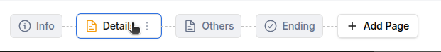

# Take-Home Assessment

## Tools
- Tooling: Vite
- Frontend: React, TypeScript, Tailwind and some third-party libs
- Tests: Vitest, Testing Library
- Deployment: GH Pages

## Local setup
- Make sure to have Node 22 or later installed
- Install dependencies: `npm install`
- Run dev server: `npm run dev`
- Access the site on http://localhost:5173/
- Run tests: `npm run test`

## Solutioning

### Requirments
#### Showing Form Pages
I decided to split the page between a top part (page editor) and a bottom part (the nav bar). This sets up a similar layout to Fillout production app. Rendering the nav items from a hardcoded list was straight forward.

#### Highlight the active page
Highlight a page on click or on keyboard key press was simple.

#### Drag to re-order pages
Initially I impleneted the drag-and-drop from scratch and later decided to use a thrid-party package (Dndkit) because it was proving to be very time consuming to build a good UX within a reasonable amount of time. The integration with Dndkit was relatively simple, with a few gotchas.

#### Adding a new page
- Between any two existing pages: This was one of the challenging bits because of the dynamic natures of the UX. I implemented a 200ms waitout to make sure the "Add" button that appears on hover would only popup if the user is hovering on the gap long enough. Because otherwise when moving the mouse over the tabs would trigger the shift in layout unintentionally and make the layout jerky. 
- Add the end of the page: This was straightforward.

#### Open a context menu per page
Added both right-click and a Kebab menu. I had a confusion about the design and got clarification from Dominic.
  - For inactive pages, the Kebab menu is supposed to be visable only on hover. This means, the nav item needs to grow in size to accomodate for the Kebab menu on the right. I have implemented this, but found the continuous layout shift on hover annoying. So I hid this behind a feature flag and can be accessed by appending `?contextMenuOnHover=true` at the end of the site URL (i.e. https://mehamasum.github.io/fillout-nav/?contextMenuOnHover=true). Remove the `?contextMenuOnHover=true` part to see the version without hover.

  
  - For the active page, after discussing with Dominic, I put the Kebab Menu on the right of the page. It shifts the layout when an inactive page becomes active on click, which can be a bit annoying. This is not as bad as doing this on hover like the inactive pages, but avoiding this kind of layout shift would be better. For example, Fillout production app replaces the page icon with the Kebab menu so the tab size doesn't need to change. Another example is Google Sheets where each tab has a persistent dropdown button. The latter would be my recommendation for the new design.

#### A11y

I implemented basic accissiblity features (for example, keyboard navigation and aria roles and attributes). There is more room for improvement.

#### Testing

Most features have been covered by integration tests.
See `/tests` for details.

### Non-requirments
Things I intentionally didn't focus on:
- I18n: Seemed out of scope.
- Theming: Seemed out of scope.
- Responsiveness: This is a just a fraction of the entire app, how this will sit in the overall page would determine how to handle responsiveness. So, skipped for now.
